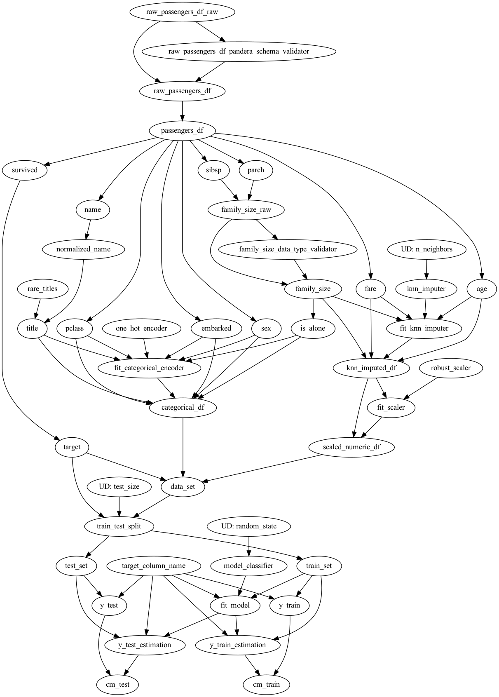
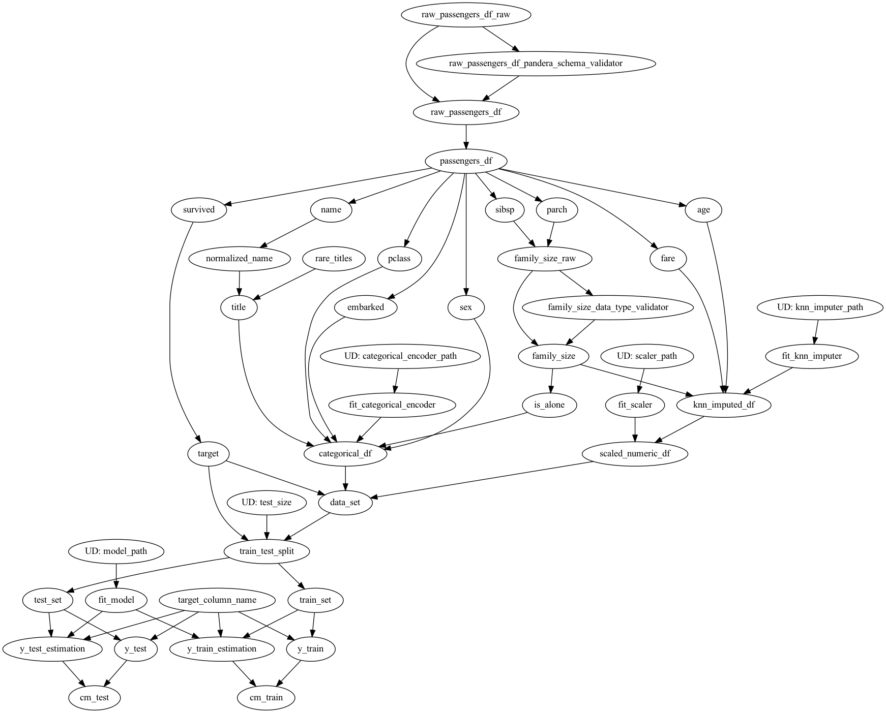

# Shows how a Hamilton version of the Titanic exercise might look

Here's the DAG being used to featurize data and fit a model:

Here's the DAG being used to featurize data and use a previously saved model and encoders:

## Points to note:

1. Unit testing.
2. Integration testing.
3. Extensibility/maintainability.
4. This is just one way.

### Unit testing
Unit testing is straightforward. The idea would be for logic that you want to ensure doesn't change,
you'd write a test around it. E.g. `test_feature_transforms.py` has an example.

### Integration testing
Integration testing is straightforward. It is easy to instantiate the DAG and only execute certain parts of it.
For example, if someone wants to test getting the output of a specific function, all that needs to be done to integration
test that function, is request only that from the driver. It will only walk the DAG required to compute the
requested output.

### Extensibility/maintainability
This code should be more maintainable than dealing with objects! Objects force coupling. But objects within
objects just gets complex and to a novice, hard to initially understand and easy to misuse. Focusing on most
logic being in simple functions, that are declaratively stitched together, makes it pretty clear how logic is used, 
and thus how it could be updated/changed.

### This is just one way to do it
There is flexibility in how you structure your modules and what the contents of functions are. 
This is just one way to do it. The nice thing is, that if you wanted to change/add a few things, you
don't have to drastically change much code to do so!

## Code Description
Walking through each file:

### data_loader.py
Contains functions to load the titanic data. Paths for loading from sqllite and pulling from the internet
exist here, as well as a basic schema check.

### feature_transforms.py
Contains transforms to create features and the data set that should be used.
Notice, how clear it is to test/change different logic.

### model_pipeline.py
Contains transforms to fit a model and to evaluate it.

### run.py
This is a script that binds together context:

 - modules that define the dataflow.
 - configuration to instantiate the right DAG.
 - code to save the artifacts.

It is very easy to have multiple `run.py` files for different contexts. That way it's easy to maintain/manage
different contextual requirements, without it burdening the transform logic in the different modules.

To execute:
> python run.py 

### test_feature_transforms.py
This is just an example showing how to unit test code using pytest.

> python pytest test_feature_transforms.py

## What's not here?
We could add:

1. Documentation. We could add a lot more documentation for each transform if we wanted to convey certain decisions/important points.
Note, we could easily add sphinx documentation and then surface our functions in an easy to find way!
2. Unit tests. We could add a lot more unit test coverage.
3. Inference pipeline. From the original example, it's not clear what is required for inference, so nothing here is really built out for that.

